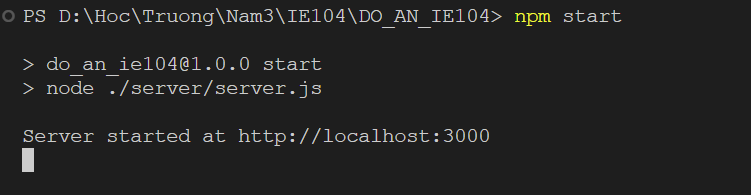
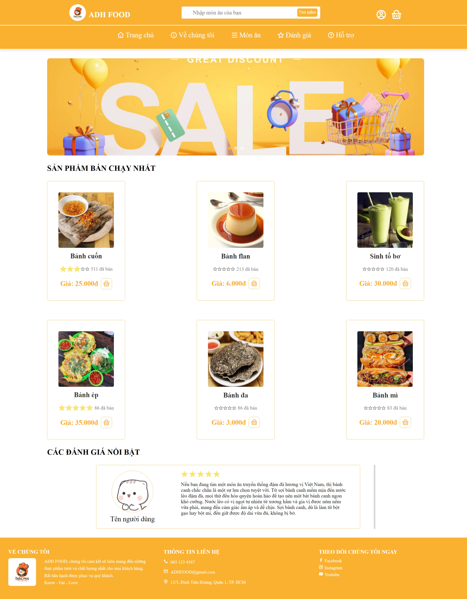

<p align="center">
  <a href="https://www.uit.edu.vn/" title="Trường Đại học Công nghệ Thông tin" style="border: none;">
    
  </a>
</p>

<h1 align="center"><b>ĐỒ ÁN INTERNET VÀ CÔNG NGHỆ WEB</b></h1>

# THÀNH VIÊN NHÓM

| STT |   MSSV   |           Họ và Tên |                  Email |
|-----|:--------:|--------------------:|-----------------------:|
| 1   | 22520185 | Nguyễn Thị Trâm Đan | 22520185@gm.uit.edu.vn |
| 2   | 22520066 | Nguyễn Trần Bảo Anh | 22520066@gm.uit.edu.vn |
| 3   | 22520449 |       Võ Chính Hiệu | 22520449@gm.uit.edu.vn |

# GIỚI THIỆU MÔN HỌC

* **Tên môn học:** Internet và công nghệ Web
* **Lớp:**  IE104.P13.CNVN
* **Đề tài:** Xây dựng web cửa hàng bán đồ ăn trực tuyến.

# Công nghệ sử dụng

* [Node.js] - Xử lý API, Back-end
* [Express] - Tạo RESTful API
* [NodeMailer] - Gửi mail xác nhận
* [HTML-CSS-JS] - Xử lý Front-end

# Hướng dẫn cài đặt

Yêu cầu máy tính đã cài đặt [Node.js](https://nodejs.org/) để chạy được project.

* Bước 1: Thực hiện clone project về máy tính

```
https://github.com/anhntb/FoodWeb_FE_IE104.git
```

* Bước 2: Chạy lệnh sau để cài đặt các thư viện cần thiết

```
npm install
```

* Bước 3: Chạy lệnh sau để khởi động server

```
npm start
```

Nếu terminal hiện thông báo như sau thì server đã khởi động thành công


* Bước 4: Bật liveserver và truy cập vào đường dẫn sau

Lưu ý: Đường dẫn có thể thay đổi tùy vào cấu hình port của liveserver

```
http://127.0.0.1:5500/TrangChu/TrangChu.html
```

Tên đăng nhập:
```
admin
```

Mật khẩu:
```
admin123
```



